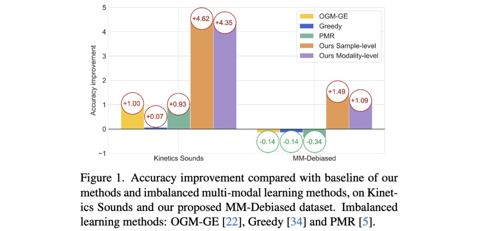

# Codes of Enhancing Multimodal Cooperation via Sample-level Modality Valuation

Here is the official PyTorch implementation of ''*Enhancing Multimodal Cooperation via Sample-level Modality Valuation*'', which aims to balance the uni-modal contribution during joint multimodal training by re-sample strategy. Please refer to our [CVPR 2024 paper](https://arxiv.org/abs/2309.06255) for more details.

**Paper Title: "Enhancing multimodal Cooperation via Sample-level Modality Valuation"**

**Authors: [Yake Wei](https://echo0409.github.io/), Ruoxuan Feng, Zihe Wang and [Di Hu](https://dtaoo.github.io/index.html)**

**Accepted by: IEEE Conference on Computer Vision and Pattern Recognition(CVPR 2024)**

## Challenge of sample-level modality discrepancy

The imbalanced multimodal learning problem, where most existing models cannot jointly utilize all modalities well Some methods, has raised lots of attention. However, the former methods only consider the global modality discrepancy at dataset-level, and achieve improvement on common curated dataset (as Kinetics Sounds dataset in Figure 1). 

    

But under realistic scenarios, the modality discrepancy could vary across different samples. For example, Figure 2 (a) and (b) show two audio-visual samples of *motorcycling* category. The motorcycle in *Sample 1* is hard to observe while the wheel of motorcycle in *Sample 2* is quite clear.
This could make audio or visual modality contribute more to the final prediction respectively for these two samples. This fine-grained modality discrepancy is hard to perceive by existing methods. Hence, how to reasonably observe and improve multimodal cooperation at sample-level is still expected to be resolved. To highlight this sample-level modality discrepancy, we propose the global balanced **MM-Debiased dataset** where the dataset-level modality discrepancy is no longer significant (as Figure 2 (d)). Not surprisingly, existing imbalanced multimodal learning methods which only consider dataset-level discrepancy fail on MM-Debiased dataset, as shown in Figure 1. 

    

In this paper, we introduce a sample-level modality valuation metric, to observe the contribution of each modality during prediction for each sample. Then, we propose the fine-grained as well as effective **sample-level re-sample method** and the coarse but efficient **modality-level re-sample method**. As Figure 1, our methods considering the sample-level modality discrepancy achieves considerable improvement on both existing curated and global balanced dataset.

## Code instruction

### Data Preparation
#### Public datasets
The original datasets we used can be found in：
[Kinetics-Sounds](https://github.com/cvdfoundation/kinetics-dataset),
[UCF101](https://www.crcv.ucf.edu/data/UCF101.php).

#### MM-Debiased dataset
For the proposed MM-Debiased dataset, the json files of data samples are [here](/MM-Debiased/MM-Debiased.json).

Samples of MM-Debiased dataset are selected from VGG-Sound and Kinetics-400 datasets.

This is one example data sample from VGGSound dataset:
<pre><code>
"RTWs-Y_usjs_000017_000027": {"subset": "validation", "label": "motorcycling"}
# "RTWs-Y_usjs_000017_000027": sample id of VGGSound
</code></pre>

This is one example data sample from Kinetics-400 dataset:
<pre><code>
"ZUJ5LJGX9oc_20": {"subset": "validation", "label": "lawn mowing"}
# "ZUJ5LJGX9oc_20": sample id of Kinetics-400
</code></pre>
#### Data preprocessing
Please refer to [here](https://github.com/GeWu-Lab/OGM-GE_CVPR2022).

### Run
You can simply run the code using:  
<pre><code>
python code/baseline.py  # Joint training baseline
</code></pre>
<pre><code>
python code/sample_level.py  # Sample-level method
</code></pre>
<pre><code>
python code/modality_level.py  # Modality-level method
</code></pre>

## Citation
If you find this work useful, please consider citing it.

<pre><code>
@inproceedings{wei2024enhancing,
  title={Enhancing multimodal Cooperation via Sample-level Modality Valuation},
  author={Wei, Yake and Feng, Ruoxuan and Wang, Zihe and Hu, Di},
  booktitle={Proceedings of the IEEE/CVF Conference on Computer Vision and Pattern Recognition},
  year={2024}
}
</code></pre>
